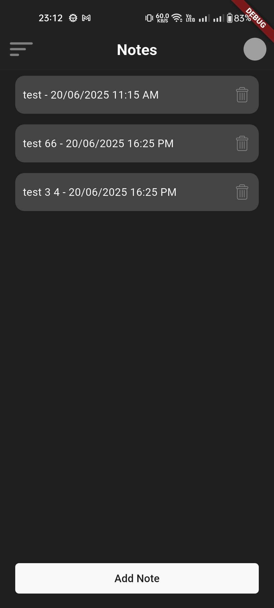
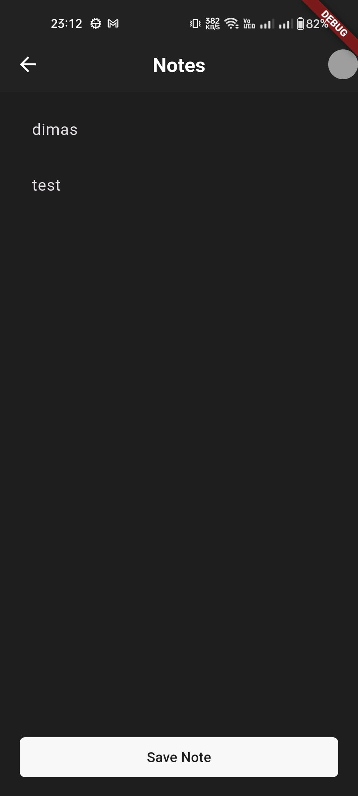
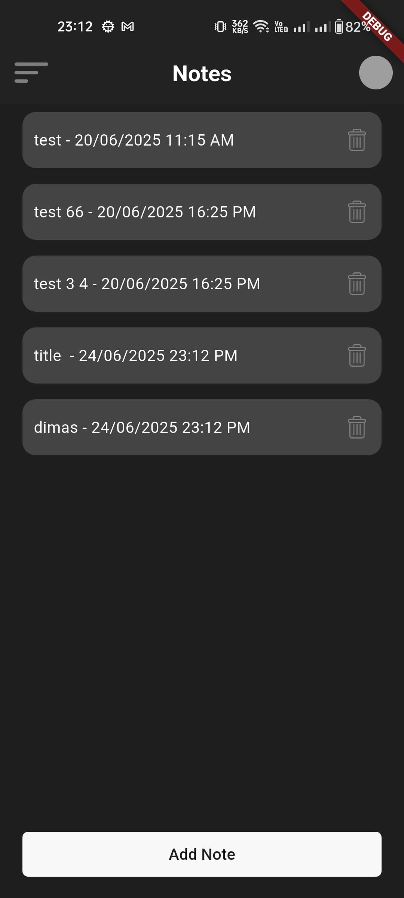

# workshop_getx_meetap_app_notes

A simple Flutter notes app using **GetX** for state management and **GetStorage** for local persistence.

## Features
- Add, edit, and delete notes
- Save Local Data With GetStorage
- State Management Reactive with GetX (`RxList`, `Obx`)
- Navigation Between Pages With GetX Route

## Image

## Kontributor

- Dimas
- Renaldi
